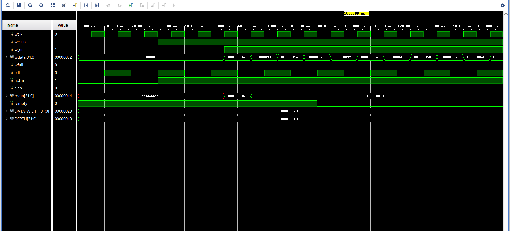
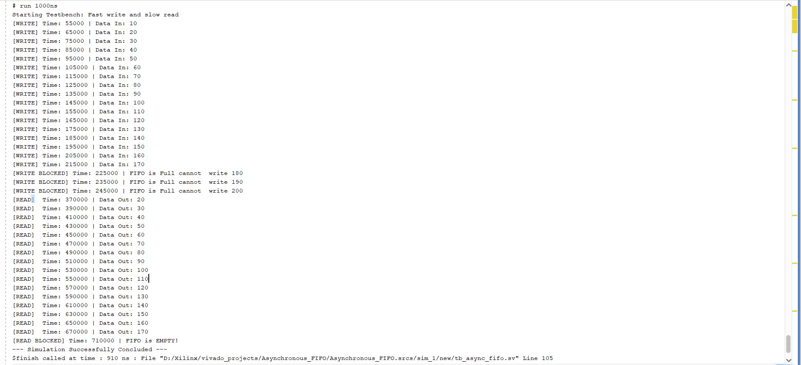

# Parameterized Asynchronous FIFO Bridge (Clock Domain Crossing)

A high-performance, fully parameterized Asynchronous FIFO implemented in SystemVerilog. This design serves as a robust hardware bridge for safely transmitting multi-bit data words between completely independent, asynchronous clock domains (Fast Write Domain $\rightarrow$ Slow Read Domain) without risking data corruption, bus skew, or metastability.

---

## 🛠️ System Architecture & Design Highlights

When a data bus crosses asynchronous boundaries, individual bits experience distinct propagation delays (wire skew). If binary pointers are directly sampled across domains, a change from `3` (`4'b0011`) to `4` (`4'b0100`) can be misread as any arbitrary value if bits arrive out of sync. 

This architecture systematically neutralizes these vulnerabilities through the following mechanisms:

* **Multi-Stage (2-FF) Synchronizers:** Mitigates metastability risks at the clock domain boundaries by giving unstable signals an extra clock cycle to settle before evaluation.
* **Gray Code Pointer Encoding:** Pointers are converted to Gray Code where exactly one bit changes per increment step. This ensures that even in the presence of extreme bus skew, a cross-domain register can only ever misread a pointer by a maximum of 1 step, entirely neutralizing multi-bit corruption.
* **First-Word Fall-Through (FWFT):** Utilizing a combinational memory read-path, the data sitting at the current read address is continuously exposed on the output bus. The consumer circuit can read it instantly without waiting an extra clock cycle for a register read penalty.
* **Circular Ring Buffer:** Utilizes direct Gray Code pattern-matching to calculate precise boundaries (`wfull` and `rempty`), safely halting data streams during extreme traffic scenarios.

---

## 📁 Project Directory Hierarchy

| File Name | Structural Layer | Functional Description |
| :--- | :--- | :--- |
| **`async_fifo.sv`** | Top-Level Wrapper | Structural module stitching together the RAM core, the synchronizer pipelines, and the independent domain controllers. |
| **`fifo_mem_array.sv`** | Memory Core | Dual-port synchronous RAM matrix configured for concurrent, un-clocked combinational reads (FWFT) and clocked sequential writes. |
| **`fifo_write_ctrl.sv`** | Write Domain Logic | Drives the write pointer engine (`wptr`, `wbin`), tracks native addresses (`waddr`), and asserts the `wfull` flag. |
| **`fifo_read_ctrl.sv`** | Read Domain Logic | Drives the read pointer engine (`rptr`, `rbin`), tracks native addresses (`raddr`), and asserts the `rempty` flag. |
| **`cdc_synchronizer.sv`** | CDC Pipeline Layer | A generic, parameterized 2-Stage Flip-Flop pipeline used to synchronize pointer buses between clocks. |
| **`tb_async_fifo.sv`** | Verification Layer | Clock-accurate verification environment driving a 100MHz producer write domain into a 50MHz consumer read domain. |

---

## ⚠️ Challenges Faced & Hardware Solutions

During behavioral verification, several timing artifacts and latency conditions were identified and systematically resolved:

### 1. The Missing Packet Zero (`10`) & Buffer Overrun
* **The Problem:** Initial simulation runs writing 20 items consecutively into a `DEPTH = 16` matrix resulted in the first payload (`10`) disappearing entirely from the final log report. 
* **The Diagnostic:** Because the Write Domain (**100 MHz**) operates twice as fast as the Read Domain (**50 MHz**), the write pointer successfully lapped the un-synchronized read pointer. The system executed a wrap-around, and payload `170` physically overwrote the memory cell holding `10` at index `0` before the read controller was kicked off. 
* **The Fix:** This highlighted the correct operational limit of the safety boundaries. The `wfull` flag dropped an anchor at exactly **Time: 225000**, successfully blocking subsequent payloads (`180`, `190`, `200`) from completely destroying the remaining unread buffer matrix.

### 2. The Multi-Cycle Synchronizer Latency (Ghost Data Printing)
* **The Problem:** After resolving pointer drift, the testbench terminal log reported a stale, recurring payload (`20`) at the tail end of the read sequence at the exact picosecond the FIFO hit its empty state.
* **The Diagnostic:** This behavior highlighted the physics of **Clock Domain Crossing latency**. Because the read pointer must clear a 2-Stage Flip-Flop synchronization pipeline (`cdc_synchronizer`) before the write domain or status flags can register its movement, there is an absolute **2 to 3 clock cycle propagation delay** across the die. The testbench software loop (`while (!rempty)`) was reading the un-overwritten stale data cells before the physical flag status had cleared the synchronizer registers.
* **The Fix:** Implemented a real-hardware data consumption protocol within the testbench driver block using an instantaneous conditional gate (`if (r_en && !rempty)`). This safely masks out the hardware latency window, filtering out stale ghost values completely.

---

## 📈 Functional Verification & Timeline Simulation

The design was fully validated under behavioral simulation using the Xilinx Vivado XSim compiler engine. The simulation environment maps a **100MHz `wclk` (10ns period)** directly against an asynchronous **50MHz `rclk` (20ns period)**.

### Behavioral Waveform Execution Tracking
Below is the captured hardware simulation timeline highlighting the synchronization delays across clock domain crossings, the assertion of the full flag boundary condition, and subsequent sequential read drains:



### Tcl Console Output Logs
The printed console report verifies perfect data sequence tracking, full-buffer write safety blocks, and zero-delay empty-flag hardware shutdowns:



```text
Starting Testbench: Fast write and slow read
[WRITE] Time: 55000 | Data In: 10
[WRITE] Time: 65000 | Data In: 20
[WRITE] Time: 75000 | Data In: 30
[WRITE] Time: 85000 | Data In: 40
[WRITE] Time: 95000 | Data In: 50
[WRITE] Time: 105000 | Data In: 60
[WRITE] Time: 115000 | Data In: 70
[WRITE] Time: 125000 | Data In: 80
[WRITE] Time: 135000 | Data In: 90
[WRITE] Time: 145000 | Data In: 100
[WRITE] Time: 155000 | Data In: 110
[WRITE] Time: 165000 | Data In: 120
[WRITE] Time: 175000 | Data In: 130
[WRITE] Time: 185000 | Data In: 140
[WRITE] Time: 195000 | Data In: 150
[WRITE] Time: 205000 | Data In: 160
[WRITE] Time: 215000 | Data In: 170
[WRITE BLOCKED] Time: 225000 | FIFO is Full cannot write 180
[WRITE BLOCKED] Time: 235000 | FIFO is Full cannot write 190
[WRITE BLOCKED] Time: 245000 | FIFO is Full cannot write 200
[READ]  Time: 370000 | Data Out: 20
[READ]  Time: 390000 | Data Out: 30
[READ]  Time: 410000 | Data Out: 40
[READ]  Time: 430000 | Data Out: 50
[READ]  Time: 450000 | Data Out: 60
[READ]  Time: 470000 | Data Out: 70
[READ]  Time: 490000 | Data Out: 80
[READ]  Time: 510000 | Data Out: 90
[READ]  Time: 530000 | Data Out: 100
[READ]  Time: 550000 | Data Out: 110
[READ]  Time: 570000 | Data Out: 120
[READ]  Time: 590000 | Data Out: 130
[READ]  Time: 610000 | Data Out: 140
[READ]  Time: 630000 | Data Out: 150
[READ]  Time: 650000 | Data Out: 160
[READ]  Time: 670000 | Data Out: 170
[READ BLOCKED] Time: 710000 | FIFO is EMPTY!
--- Simulation Successfully Concluded ---
